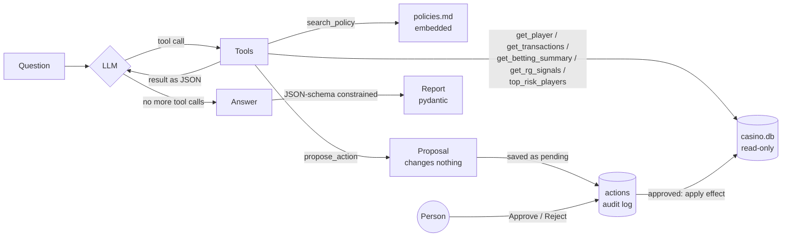

# 🎰 iGaming Ops Agent

**Live demo: [igaming-agent-production-cd4f.up.railway.app](https://igaming-agent-production-cd4f.up.railway.app)** (API docs at [/docs](https://igaming-agent-production-cd4f.up.railway.app/docs)). Ask it anything; approving actions needs an approver login.

An LLM agent that investigates player issues on a (fake) online casino platform, the kind of question a support or risk team asks all day:

> *"Why was player 1042's withdrawal declined?"*
> *"Is there anything concerning about player 1100's recent activity?"*
> *"Which players are most at risk this week?"*

The agent looks up the player's data with **tools** (SQL over a casino database), reads the relevant **policy** (RAG), and returns a free-text answer and a **typed, validated report** (category, root cause, evidence, recommended action, escalation flag), served over a **FastAPI** endpoint. It can also **propose actions** (request KYC documents, flag for RG review, set a deposit limit, block an account). They only happen after a person approves them in the UI, and every decision goes into an audit log.

The chat model is **Gemini 2.5 Flash Lite via [OpenRouter](https://openrouter.ai)** when `OPENROUTER_API_KEY` is set, and otherwise runs locally and free with [Ollama](https://ollama.com) (`qwen3:4b-instruct`). Both speak the OpenAI chat API, so the agent code is the same; only the URL changes. The trade-off: OpenRouter answers in seconds, but the player data in the prompts leaves the machine. That's fine for this fake data, but real player data would need a data-processing agreement, or the local model. Policy embeddings follow the same switch: `openai/text-embedding-3-small` through OpenRouter with the key, `nomic-embed-text` on Ollama without it, so a cloud deploy needs no Ollama. For the local model, use the non-thinking build: plain `qwen3:4b` always reasons before answering and is about 4x slower on CPU. There are no frameworks: the agent loop is about 30 lines of plain Python, so every step is visible.

## How it works



1. **Agent loop** (`run_agent`): send the question plus the tool descriptions (JSON Schema) to the LLM. If it asks for a tool, run the Python function, append the result to the conversation, and repeat. When it answers without tool calls, we're done. `max_steps` caps runaway loops.
2. **Tools**: plain functions. The LLM never touches the DB, it can only *ask* us to run these:
   - `get_player`: KYC status, account status (active / self-excluded / blocked)
   - `get_transactions`: deposits, withdrawals, bonuses, with decline reasons
   - `get_betting_summary`: totals computed in SQL (staked, payout, net, share of bets placed between midnight and 5 am, wagered since the last bonus). The tool does the arithmetic because small LLMs can't reliably add up 100 numbers.
   - `get_rg_signals`: responsible gambling signals for one player (see below) and a 0 to 100 risk score with reasons
   - `top_risk_players`: the same score for every player, ranked, so the agent can answer "who is most at risk this week?" instead of only questions about one player
   - `search_policy`: RAG over `policies.md` (one chunk per section, embeddings, cosine similarity)
   - `propose_action`: proposes `request_kyc_documents`, `flag_for_rg_review`, `apply_deposit_limit` or `block_account`. It changes nothing (see below)
3. **Structured output** (`to_report`): a second call with `response_format` (strict JSON schema, structured outputs) constrains generation to the `Report` schema, and pydantic validates it. This is a separate call because small models handle tools and forced JSON badly at the same time.

### Responsible gambling risk score

`rg_scores` computes the signals in SQL (window functions) for every player over the last N days, then adds up points:

| Signal | Rule | Points |
|---|---|---|
| Deposit pattern change | deposits ≥ 3× the usual amount (previous 4 weeks) and ≥ 200 | 25 |
| Night play | ≥ 50% of bets between midnight and 5 am (≥ 10 bets) | 20 |
| Loss chasing | average stake after a loss ≥ 2× the average stake after a win (≥ 30 bets) | 20 |
| Re-gambled withdrawals | a cancelled withdrawal followed by bets within 24 h | 15 |
| Session length | a session (no gap over 30 min) of 3+ hours | 10 |
| Deposit limit hit | a deposit declined with `deposit_limit_reached` | 10 |

The thresholds and weights are hand-picked. The minimum bet counts stop random noise from looking like loss chasing. A real platform would calibrate them on cases the RG team has labelled.

### Write actions, human approval and the audit log

The agent can't change anything. `propose_action` only validates the proposal and returns it. It refuses proposals that would do nothing if approved (blocking an account that isn't active, or a deposit limit that isn't lower than the current one), so an approved row always means a real change. The API saves it as **pending** (if the same action is already pending for that player, it reuses it rather than queueing a duplicate) in the `actions` table and shows it in the UI, where a person logs in and clicks **Approve** or **Reject**. Only an approved action has an effect, applied in the same transaction as the decision by `actions.py`, the only module that opens the DB for writing:

| Action | Effect when approved |
|---|---|
| `request_kyc_documents`, `flag_for_rg_review` | none in the DB: the approved row is the work item for the KYC / RG team |
| `apply_deposit_limit` | sets the weekly deposit limit, but can only **lower** an existing one (the policy requires a cooling period for increases) |
| `block_account` | blocks an active account; a self-excluded player stays self-excluded |

The `actions` table is the audit trail: who proposed what and why, the original question, who approved or rejected it, and when. The **database** enforces it with triggers, so even a bug in the app can't rewrite history: rows can't be deleted, a decision is final, and the proposal can't be edited afterwards.

Approvers log in with HTTP Basic auth (the browser shows its own prompt). Accounts come from the `APPROVERS` env var, `name:password` pairs separated by commas; if it isn't set, nobody can approve. The audit log records the **login** name, never a name sent in the request. In production this would be SSO (OIDC), with the user taken from its token. Re-running `seed.py` rebuilds the DB, which also wipes the audit log; in production the audit log would live in its own store.

```bash
curl localhost:8000/actions                                   # audit log, pending first
curl -X POST localhost:8000/actions/1/decision -u j.smith:secret1 -H 'Content-Type: application/json' \
     -d '{"approve": true}'
```

### Safety and robustness choices

| Risk | What the code does |
|---|---|
| SQL injection via LLM-chosen arguments | `?` placeholders only, and a test proves an injection string matches nothing |
| LLM modifying data | Agent's DB connection is **read-only** (`mode=ro`); writes happen only in `actions.py`, after a person approves |
| Rewriting the audit trail | DB triggers: no deletes, a decision is final, proposals can't be edited |
| Two people deciding the same action | The decision only applies `WHERE status = 'pending'`; the second one gets `409` |
| Hallucinated tool name or bad arguments | `call_tool` returns the error *to the model* so it can retry, instead of crashing |
| Answering from nothing (Gemini Flash Lite said "bonus wagering" for a KYC case without looking anything up) | The first step must call a tool (`tool_choice: required`) |
| Shallow answers ("declined: kyc_not_verified", no next step) and no proposals | Guardrail, once: before the final answer the model is asked to read the policy and propose what it calls for. If it does nothing new, its first answer stands |
| Saying "I propose to flag this account" without calling the tool | `search_policy` returns a reminder with the policy text: writing it in the answer doesn't create a proposal |
| Network blips and rate limits on the cloud API | Up to 3 tries for dropped connections, `429` and `5xx`; a bad key (`401`) fails at once |
| Infinite tool loops | `max_steps=8` |
| Unparseable output | Schema-constrained decoding plus pydantic validation |
| LLM down, too slow, bad API key or rate limited | API returns `503` with a clear message (including OpenRouter's error); each LLM call times out after `LLM_TIMEOUT` seconds (default 900, for slow local CPUs) |

## The data

`seed.py` builds `casino.db` (SQLite) with 200 random players, 12 fictional games, and transactions and bets, with a fixed random seed so the data is the same every run. It also plants five cases the agent must explain:

| Player | Situation | What the agent should find |
|---|---|---|
| 1042 | Big win, withdrawal declined | KYC still `pending`, so ask for ID documents |
| 1077 | Took a 100 bonus, withdrawal declined | Wagered ~900 of the required 35 × 100 = 3500 |
| 1100 | Deposits 20 → 1000 in two weeks, all play 1 to 5 am, hit their 3500 weekly deposit limit | Responsible gambling risk, escalate, no promotions |
| 1150 | Self-excluded, tried to deposit | Must not reopen the account; notify the RG team |
| 1180 | Doubles the stake after every loss, 4-hour sessions, cancels withdrawals to keep playing | Loss chasing; second on the risk ranking, for different reasons than 1100 |

## Quick start

```bash
ollama pull nomic-embed-text                          # policy search embeddings; not needed with an OpenRouter key
echo 'OPENROUTER_API_KEY=sk-or-...' > .env            # Gemini via OpenRouter; git-ignored
set -a; source .env; set +a                           # or skip both lines and `ollama pull qwen3:4b-instruct`
pip install -r requirements.txt
python seed.py                                        # build casino.db

python agent.py "Why was player 1042's withdrawal declined?"   # CLI
APPROVERS=j.smith:secret1 uvicorn api:app --reload    # UI at localhost:8000, API docs at /docs
```

```bash
curl -X POST localhost:8000/investigate -H 'Content-Type: application/json' \
     -d '{"question": "Is there anything concerning about player 1100?"}'
```

### Docker

With `OPENROUTER_API_KEY` in `.env`, the container needs nothing else, so it also runs on a cloud host such as Railway (it listens on `$PORT`). Without the key, Ollama stays on the host. The container reaches it through `host.docker.internal`:

```bash
docker build -t igaming-agent .
docker run -p 8000:8000 -e APPROVERS=j.smith:secret1 --env-file .env igaming-agent
```

## Testing and eval

```bash
python test_tools.py   # instant, no LLM: tools, RG score, approvals and audit log, SQL injection, error handling
python eval.py         # end-to-end on the planted cases (slow on CPU, real LLM)
```

`eval.py` runs the whole agent on each case in `eval_cases.json` and checks four things: the report's **category**, its **escalation flag**, whether the **answer** mentions the key fact (for example "3500" for the bonus case), and whether the agent **proposed the right actions** (for example `request_kyc_documents` for 1042, never `block_account` for the self-excluded 1150). One case is a player who doesn't exist, to check that the agent says so instead of making up a reason. Swap models with `MODEL=llama3.1:8b python eval.py`.

<!-- EVAL_RESULTS -->
Latest run (`eval_out.txt`):

| Model | Fully correct | Category | Escalation | Answer | Actions | Time per case |
|---|---|---|---|---|---|---|
| `google/gemini-2.5-flash-lite` (OpenRouter) | **7/7** | 7/7 | 7/7 | 7/7 | 7/7 | ~6 s |

The eval found real bugs on the way there: the agent never proposed any action, the nudge looped until it ran out of steps, an unknown player looked like "nothing was declined", and plain `qwen3:4b` spent ~90% of its time writing hidden reasoning. The local `qwen3:4b-instruct` gives the right answer and proposal on the KYC case in about 5 minutes on an Intel CPU; a full local run takes about 30 minutes.

## What I'd do next

- **SSO** for approvers instead of Basic auth, and four-eyes approval (two people) for `block_account`
- **Calibrate the risk score** on cases the RG team labels, and run `top_risk_players` on a schedule so the team gets a daily list
- **More eval cases**, and an LLM-as-judge score for answer quality instead of keyword checks
- **Streaming** the agent's steps to a small UI, so support staff can watch it investigate
- **Per-player access control**: in a real platform the agent should only see players the operator is allowed to see

## Files

| File | What |
|---|---|
| `agent.py` | Tools, RG risk score, tool specs, agent loop, policy RAG, structured report |
| `actions.py` | Saves proposals, approve / reject, applies approved actions (the only writer) |
| `api.py` | FastAPI: `GET /` (UI), `POST /investigate`, `GET /actions`, `POST /actions/{id}/decision`, `GET /health` |
| `index.html` | Single-page UI for support staff: plain-language answer, RG warning, approvals, decision history, glossary |
| `favicon.ico` | Slot machine icon from [Twemoji](https://github.com/jdecked/twemoji), CC-BY 4.0 |
| `seed.py` | Builds the fake casino DB with the planted cases |
| `policies.md` | Fictional platform policies (KYC, bonus wagering, RG, limits, self-exclusion) |
| `test_tools.py` | Fast offline tests |
| `eval.py`, `eval_cases.json` | End-to-end agent eval |
