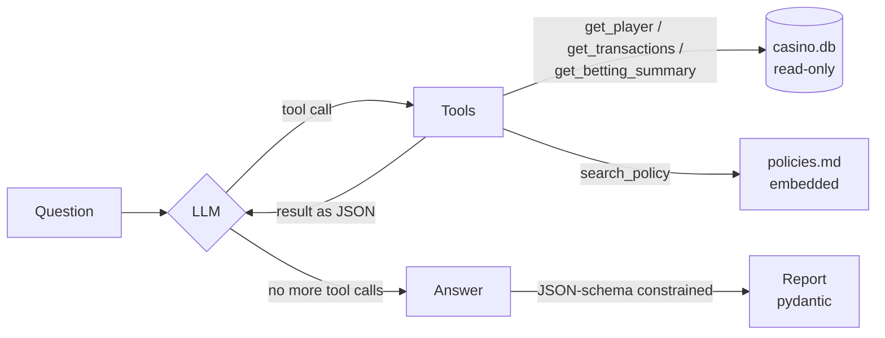

# 🎰 iGaming Ops Agent

An LLM agent that investigates player issues on a (fake) online casino platform, the kind of question a support or risk team asks all day:

> *"Why was player 1042's withdrawal declined?"*
> *"Is there anything concerning about player 1100's recent activity?"*

The agent looks up the player's data with **tools** (SQL over a casino database), reads the relevant **policy** (RAG), and returns a free-text answer and a **typed, validated report** (category, root cause, evidence, recommended action, escalation flag), served over a **FastAPI** endpoint.

Everything runs locally and free with [Ollama](https://ollama.com) (`qwen3:4b`). There are no API keys and no frameworks: the agent loop is about 30 lines of plain Python, so every step is visible.

## How it works



1. **Agent loop** (`run_agent`): send the question plus the tool descriptions (JSON Schema) to the LLM. If it asks for a tool, run the Python function, append the result to the conversation, and repeat. When it answers without tool calls, we're done. `max_steps` caps runaway loops.
2. **Tools**: four plain functions. The LLM never touches the DB, it can only *ask* us to run these:
   - `get_player`: KYC status, account status (active / self-excluded / blocked)
   - `get_transactions`: deposits, withdrawals, bonuses, with decline reasons
   - `get_betting_summary`: totals computed in SQL (staked, payout, net, share of bets placed between midnight and 5 am, wagered since the last bonus). The tool does the arithmetic because small LLMs can't reliably add up 100 numbers.
   - `search_policy`: RAG over `policies.md` (one chunk per section, `nomic-embed-text`, cosine similarity)
3. **Structured output** (`to_report`): a second call with Ollama's `format=<JSON schema>` constrains generation to the `Report` schema, and pydantic validates it. This is a separate call because small models handle tools and forced JSON badly at the same time.

### Safety and robustness choices

| Risk | What the code does |
|---|---|
| SQL injection via LLM-chosen arguments | `?` placeholders only, and a test proves an injection string matches nothing |
| LLM modifying data | DB opened **read-only** (`mode=ro`) |
| Hallucinated tool name or bad arguments | `call_tool` returns the error *to the model* so it can retry, instead of crashing |
| Shallow answers ("declined: kyc_not_verified", no next step) | Guardrail: if the model tries to answer without checking policy, it is nudged once to call `search_policy` |
| Infinite tool loops | `max_steps=8` |
| Unparseable output | Schema-constrained decoding plus pydantic validation |
| Ollama down | API returns `503` with a clear message |

## The data

`seed.py` builds `casino.db` (SQLite) with 200 random players, 12 fictional games, and transactions and bets, with a fixed random seed so the data is the same every run. It also plants four cases the agent must explain:

| Player | Situation | What the agent should find |
|---|---|---|
| 1042 | Big win, withdrawal declined | KYC still `pending`, so ask for ID documents |
| 1077 | Took a 100 bonus, withdrawal declined | Wagered ~900 of the required 35 × 100 = 3500 |
| 1100 | Deposits 20 → 1000 in two weeks, all play 1 to 5 am, hit deposit limit | Responsible gambling risk, escalate, no promotions |
| 1150 | Self-excluded, tried to deposit | Must not reopen the account; notify the RG team |

## Quick start

```bash
ollama pull qwen3:4b && ollama pull nomic-embed-text
pip install -r requirements.txt
python seed.py                                        # build casino.db

python agent.py "Why was player 1042's withdrawal declined?"   # CLI
uvicorn api:app --reload                              # API, docs at localhost:8000/docs
```

```bash
curl -X POST localhost:8000/investigate -H 'Content-Type: application/json' \
     -d '{"question": "Is there anything concerning about player 1100?"}'
```

### Docker

Ollama stays on the host (the models are GBs). The container reaches it through `host.docker.internal`:

```bash
docker build -t igaming-agent .
docker run -p 8000:8000 igaming-agent
```

## Testing and eval

```bash
python test_tools.py   # instant, no LLM: tools, ordering, SQL injection, error handling
python eval.py         # end-to-end on the planted cases (slow on CPU, real LLM)
```

`eval.py` runs the whole agent on each case in `eval_cases.json` and checks three things: the report's **category**, its **escalation flag**, and whether the **answer** mentions the key fact (for example "3500" for the bonus case). One case is a player who doesn't exist, to check that the agent says so instead of making up a reason. Swap models with `MODEL=llama3.1:8b python eval.py`.

<!-- EVAL_RESULTS -->

## What I'd do next

- **Write actions with human approval**: tools like `request_kyc_documents` or `flag_for_rg_review` that only run after a person confirms
- **More eval cases**, and an LLM-as-judge score for answer quality instead of keyword checks
- **Streaming** the agent's steps to a small UI, so support staff can watch it investigate
- **Per-player access control**: in a real platform the agent should only see players the operator is allowed to see

## Files

| File | What |
|---|---|
| `agent.py` | Tools, tool specs, agent loop, policy RAG, structured report |
| `api.py` | FastAPI: `POST /investigate`, `GET /health` |
| `seed.py` | Builds the fake casino DB with the planted cases |
| `policies.md` | Fictional platform policies (KYC, bonus wagering, RG, limits, self-exclusion) |
| `test_tools.py` | Fast offline tests |
| `eval.py`, `eval_cases.json` | End-to-end agent eval |
